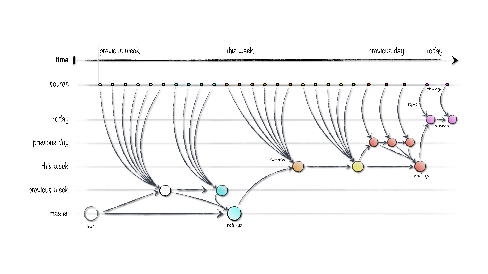

# [Live Version](https://anupam-arohi.github.io/lv/)

An insurance system for your precious work!

Full documentation: <https://anupam-arohi.github.io/lv/>

## Prerequisites 
- Linux or Mac system (This for you if you're comfy with terminal)
- [git](https://git-scm.com/book/en/v2/Getting-Started-Installing-Git)
- [watcher](https://github.com/gregghz/Watcher) (only for Linux)

## Installation

Following steps would get you started:

1. [Download Live Version][dnld].

2. Go to the LiveVersion folder and execute `source ./setup`.

3. If you see "Success!", all went well. It is ready.

####

    $ cd lv-master 
    $ source ./setup
    Success!

## Quick Usage

    $ watch foldername or filename

### Examples:

    1. $ watch ~/projects/my_project    # watch folder my_project
    2. $ watch ~/.bash_profile          # watch file .bash_profile
    3. $ watch /etc/hosts               # watch file /etc/hosts to track configuration

In Example 1. `watch ~/projects/my_project`, watch command will:

- Will ask for the default values (first time execution only).
- Create a Live Repository in ~/LiveRepos.
- On Mac, Create a new [LaunchAgent](https://developer.apple.com/library/archive/documentation/MacOSX/Conceptual/BPSystemStartup/Chapters/CreatingLaunchdJobs.html) to watch the folder.
- On Linux, Create a new [Watcher job](https://github.com/gregghz/Watcher/blob/master/jobs.yml) or [incrond](https://www.cyberciti.biz/faq/linux-inotify-examples-to-replicate-directories/) entry. 
- Live Version activity would be logged in `~/logs/my_project.projects.log` by default.

Note: incrond works only at single directory level, changes in subdirectories are not tracked by it.

## Advance Usage

    $ lv /full/source/path /full/destination/path [/log/file] [email]

Where:

- `/full/source/path` is the absolute path of the file or folder that you want to be versioned live.
- `/full/destination/path` is absolute path of the Live Repository where a versioned copy of the source would reside.
- `/log/file` is an optional parameter that gives absolute path of the log file where log of activities would be kept.
- `email` is an experimental feature; works only on shell environment.

This is one time execution, you may want to add this to your build script or custom [launchd property list file](https://developer.apple.com/library/archive/documentation/MacOSX/Conceptual/BPSystemStartup/Chapters/CreatingLaunchdJobs.html), or [incrontab](https://www.cyberciti.biz/faq/linux-inotify-examples-to-replicate-directories/) entry.

## Recovery

To harness the power of Live Version, you would need a graphical [git client](https://git-scm.com/downloads/guis) such as [Source Tree](https://www.sourcetreeapp.com/).

Once you have the client, you can open your Live Repository in the client and see the changes in much clear context.

Check out [documentation][recovery] for more details.

Happy Versioning!

[dnld]: https://github.com/anupam-arohi/lv/archive/master.zip 
[recovery]: https://anupam-arohi.github.io/lv/documentation/Recovery/ 
[home]: https://anupam-arohi.github.io/lv/

