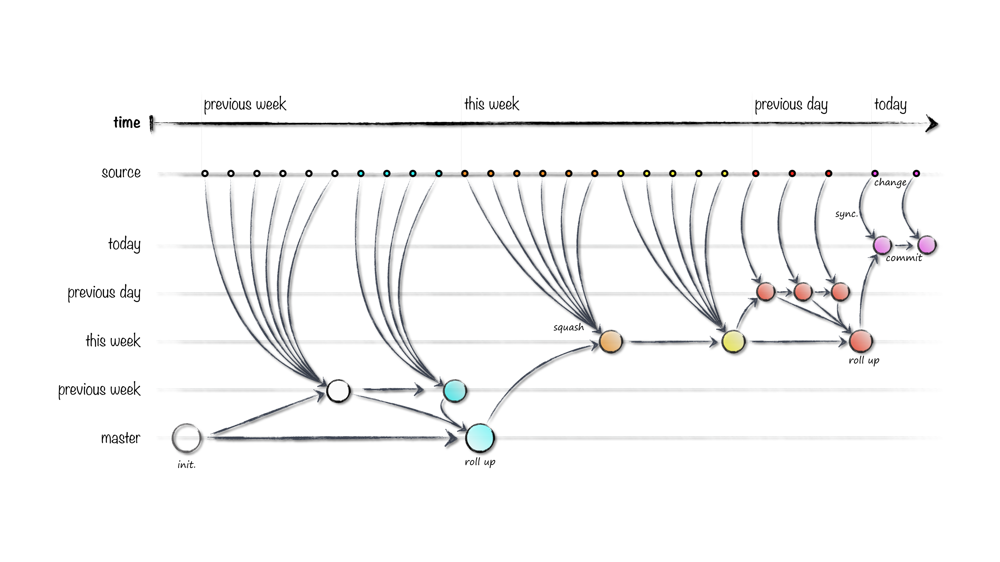

# [Live Version][home]

An insurance system for your precious work!

## Prerequisites 
- Linux or Mac system (This for you if you're comfy with terminal)
- [git](http://goo.gl/8O8hz)
- [watcher](https://github.com/gregghz/Watcher) (only for Linux)

## Installation

Following steps would get you started:

1. [Download Live Version][dnld].

2. Go to the LiveVersion folder and execute `source ./setup`.

3. If you see "Success!", all went well. It is ready.

####

    $ cd lv-master 
    $ source ./setup
    Success!

## Quick Usage

    $ watch foldername or filename

### Examples:

    1. $ watch ~/projects/my_project    # watch folder my_project
    2. $ watch ~/.bash_profile          # watch file .bash_profile
    3. $ watch /etc/hosts               # watch file /etc/hosts to track configuration

In Example 1. `watch ~/projects/my_project`, watch command will:

- Will ask for the default values (first time execution only).
- Create a Live Repository in ~/LiveRepos.
- On Mac, Create a new [LaunchAgent](http://goo.gl/FLeqgu) to watch the folder.
- On Linux, Create a new [Watcher job](http://goo.gl/5edOBt) or [incrond](http://goo.gl/B2ZAfE) entry. 
- Live Version activity would be logged in `~/logs/my_project.projects.log` by default.

Note: incrond works only at single directory level, changes in subdirectories are not tracked by it.

## Advance Usage

    $ lv /full/source/path /full/destination/path [/log/file] [email]

Where:

- `/full/source/path` is the absolute path of the file or folder that you want to be versioned live.
- `/full/destination/path` is absolute path of the Live Repository where a versioned copy of the source would reside.
- `/log/file` is an optional parameter that gives absolute path of the log file where log of activities would be kept.

This is one time execution, you may want to add this to your build script or custom [launchd property list file](http://goo.gl/8KeHBU), or [incrontab](http://goo.gl/B2ZAfE) entry.

## Recovery

To harness the power of Live Version, you would need a graphical [git client](http://git-scm.com/downloads/guis) such as [Source Tree](http://www.sourcetreeapp.com/).

Once you have the client, you can open your Live Repository in the client and see the changes in much clear context.

Check out [documentation][recovery] for more details.

Happy Versioning!

[dnld]: https://github.com/anupam-arohi/lv/archive/master.zip 
[recovery]: http://anupam-arohi.com/lv/documentation/Recovery/ 
[home]: http://anupam-arohi.com/lv 

